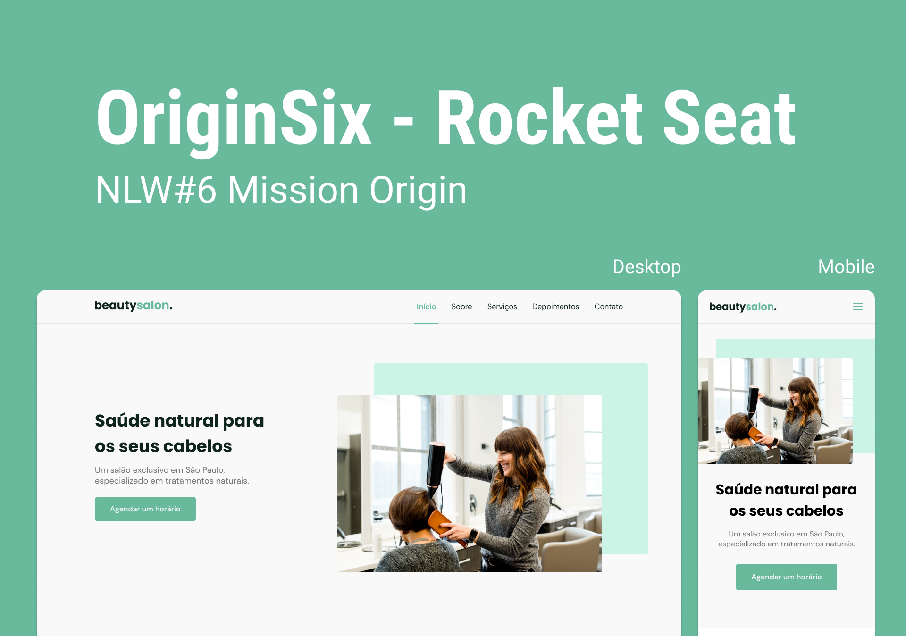

<h1>Maratona NLW Origin</h1>

  <a href="#-tecnologias">Tecnologias</a>&nbsp;&nbsp;&nbsp;|&nbsp;&nbsp;&nbsp;
  <a href="#-projeto">Projeto</a>&nbsp;&nbsp;&nbsp;|&nbsp;&nbsp;&nbsp;
  <a href="#-layout">Layout</a>

 

  

## Tecnologias

Esse projeto foi desenvolvido usando:

- HTML
- CSS
- JavaScript

Bibliotecas

- [Google Fonts](https://fonts.google.com/)
- [SwipeJS](https://github.com/nolimits4web/Swiper)
- [ScrollRevel](https://scrollrevealjs.org)

## Projeto

Esse projeto foi realizado durante a maratona Next Level Week (NLW), da Rocket Seat.
O projeto desenvolvido é uma página institucional, responsiva, que pode ser utilizado em diversos segmentos empresariais, seja micro, pequeno ou médio porte.

As principais habilidades que desenvolvi ao longo da maratona foram: conhecimento mais profundo do CSS, principalmente a parte de posicionamento dos componentes em tela e a integração e manipulação das bibliotecas JS (SwipeJS e ScrollRevel).

## 🔖 Layout

Você pode visualizar o layout do projeto através [desse link](https://www.figma.com/file/YJ21RnZoelU6tthwExzMVP/Origin-Six).
